# Cervical Spine 臨床思維導圖

```mermaid
graph TD
    start([患者主訴與初步篩查])
    start --> red_flags
    start --> screening
    red_flags{是否存在 Red Flags（VBI/後腦缺血、上頸椎不穩、脊髓病變、腫瘤/癌症警訊）?}
    red_flags -->|yes| urgent_referral
    red_flags -->|no| screening
    urgent_referral[緊急轉介：立即停止徒手治療與一般介入，轉醫師/急診進一步檢查]
    style urgent_referral fill:#ffcccc,stroke:#ff0000
    screening[主觀問診：受傷機轉、症狀分布、加劇/緩解因子、姿勢負荷、咳嗽打噴嚏是否加劇]
    screening --> contraindication_check
    screening --> arom_exam
    contraindication_check{是否懷疑血管病變徵兆或頸椎不穩定？}
    contraindication_check -->|yes| manual_therapy_block
    contraindication_check -->|no| arom_exam
    manual_therapy_block[禁止 Mobilization / Manipulation，改採醫療轉介或低風險檢查流程]
    manual_therapy_block --> arom_exam
    arom_exam[AROM 與症狀再現：屈曲、伸展、側彎、旋轉；觀察受限、疼痛、痙攣、動作阻滯]
    arom_exam --> neuro_question
    arom_exam --> mechanical_response
    neuro_question{是否出現放射痛、麻木、刺痛、無力、雙側症狀或步態異常？}
    neuro_question -->|yes| neurological_exam
    neuro_question -->|no| msk_branch
    neurological_exam[神經學檢查：Dermatomes、Myotomes、Reflexes、UMN signs（Babinski/Hoffmann/Hyperreflexia）]
    neurological_exam --> myelopathy_check
    neurological_exam --> radiculopathy_cluster
    myelopathy_check{是否有脊髓病變徵象（雙側症狀、手笨拙、步態差、UMN signs）？}
    myelopathy_check -->|yes| urgent_referral
    myelopathy_check -->|no| radiculopathy_cluster
    radiculopathy_cluster{執行 Spurling、Distraction、ULTT，判斷神經根受壓/神經動力學異常}
    radiculopathy_cluster -->|positive| cervical_radiculopathy
    radiculopathy_cluster -->|negative| msk_branch
    cervical_radiculopathy[診斷傾向：Cervical Radiculopathy；處置以減壓姿勢、方向性運動、神經滑動、必要時轉診]
    cervical_radiculopathy --> ri_shoulder
    cervical_radiculopathy --> treatment_selection
    msk_branch[肌肉骨骼分流：依疼痛型態、ROM 終末感、姿勢負荷、重複動作反應進行分類]
    msk_branch --> headache_check
    msk_branch --> mckenzie_classification
    msk_branch --> upper_crossed_check
    headache_check{是否為單側不換邊、枕下起始並受頸部動作誘發之頭痛？}
    headache_check -->|yes| cervicogenic_headache
    headache_check -->|no| mckenzie_classification
    cervicogenic_headache[執行 Flexion-Rotation Test；若陽性則傾向 C1-C2 功能障礙相關 Cervicogenic Headache]
    cervicogenic_headache --> ri_tmj
    cervicogenic_headache --> treatment_selection
    mckenzie_classification{重複動作測試是否出現 Centralization 或明確 Directional Preference？}
    mckenzie_classification -->|yes| derangement
    mckenzie_classification -->|no| end_range_pain_check
    derangement[Derangement Syndrome：以 Retraction/Extension 等可集中化症狀方向進行治療]
    derangement --> ri_thoracic
    derangement --> treatment_selection
    end_range_pain_check{疼痛是否僅在活動末端拉扯出現，停止後快速消退？}
    end_range_pain_check -->|yes| dysfunction
    end_range_pain_check -->|no| posture_check
    dysfunction[Dysfunction Syndrome：組織短縮/疤痕/ANR；採末端重塑運動與漸進伸展]
    dysfunction --> ri_thoracic
    dysfunction --> treatment_selection
    posture_check{是否僅長時間不良姿勢誘發，ROM 與神經檢查正常？}
    posture_check -->|yes| postural
    posture_check -->|no| upper_crossed_check
    postural[Postural Syndrome：姿勢矯正、工作站調整、活動中斷策略]
    postural --> ri_thoracic
    postural --> treatment_selection
    upper_crossed_check{是否呈現 Upper trapezius/Levator/SCM/Pectoralis 緊繃與深頸屈肌、下中斜方肌弱化？}
    upper_crossed_check -->|yes| upper_crossed
    upper_crossed_check -->|no| ri_thoracic
    upper_crossed[Upper Crossed Syndrome：肌長平衡重建、深頸屈肌訓練、肩胛穩定控制]
    upper_crossed --> ri_thoracic
    upper_crossed --> treatment_selection
    ri_thoracic[Regional Interdependence：檢查胸椎後凸、頸胸交界僵硬；必要時處理胸椎活動度]
    ri_thoracic --> ri_shoulder
    ri_shoulder[Regional Interdependence：肩痛需區辨頸源性；重複頸椎動作若改變肩症狀則優先處理頸椎]
    ri_shoulder --> ri_tmj
    ri_tmj[Regional Interdependence：臉痛/耳周痛/TMJ 症狀需評估上頸椎與 Forward Head Posture]
    ri_tmj --> treatment_selection
    mechanical_response[姿勢改變、仰臥減壓或反覆動作是否可改變症狀位置與強度？]
    mechanical_response --> mckenzie_classification
    treatment_selection[依分類結果制定治療：教育、運動治療、神經動力學、姿勢修正、胸椎/肩胛介入；避開禁忌徒手操作]
    treatment_selection --> reassess
    reassess([每次治療後再評估 ROM、疼痛分布、神經症狀、功能表現；若惡化或無進展則再轉診])

```

## 💎 Clinical Pearls (臨床珍珠)
- 先排除血管性與上頸椎不穩定問題，再進入一般頸椎評估流程。
- 出現雙側麻木、步態異常、手部笨拙與反射亢進時，優先懷疑 Cervical Myelopathy。
- Spurling 陽性加上 Distraction 緩解與 ULTT 陽性，提升 Cervical Radiculopathy 機率。
- Centralization 是機械性頸源痛的重要預後指標，通常優先採方向性運動。
- 肩痛不一定來自肩關節，頸椎重複動作可作為快速鑑別工具。
- 慢性頸痛常伴胸椎僵硬與前傾頭姿勢，處理胸椎可提升療效。
- TMJ、耳周與顏面痛常與上頸椎及 Trigeminocervical complex 有關。
- 任何疑似血管病變或不穩定情況下，避免 Manipulation 與高風險末端測試。
